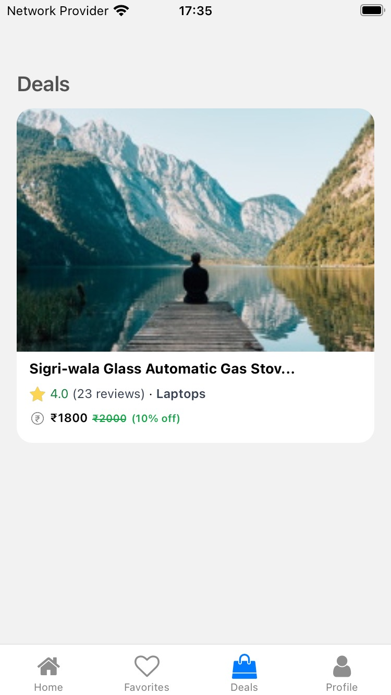

# Deals App

> The Deals App demonstrates a React Native-powered mobile app for managing and selling deals.

## Built With

- [React Native](https://reactnative.dev/) - The mobile app framework used
- [Expo](https://expo.dev/) - The mobile platform framework used
- [Supabase](https://supabase.com/) - Backend-as-a-Service (BaaS) app development platform used
- [PostgreSQL](https://www.postgresql.org/) - The relational database used

## Authors

- **[Pemberai Sweto](https://github.com/thepembeweb)** - _Initial work_ - [Deals App](https://github.com/thepembeweb/deals-mobile-app)

## License

- This project is licensed under the MIT License - see the [LICENSE.md](LICENSE.md) file for details
- Copyright 2023 © [Pemberai Sweto](https://github.com/thepembeweb).
